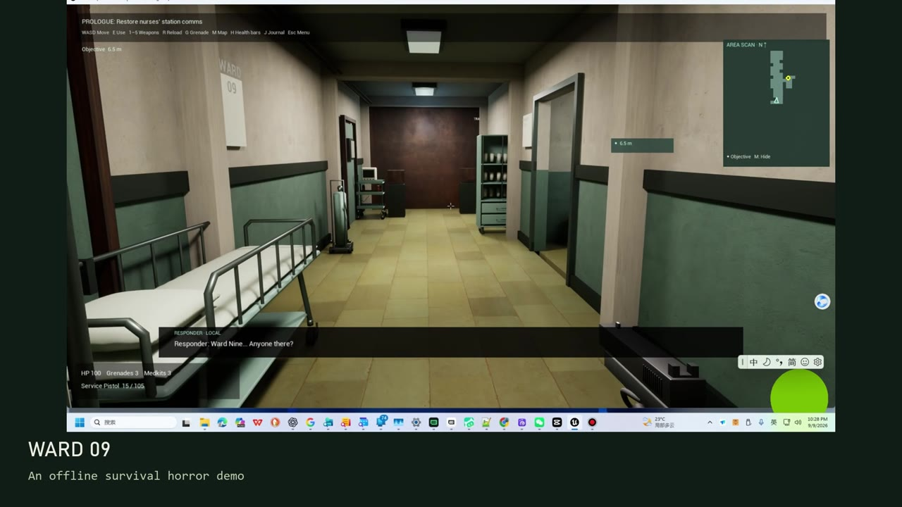
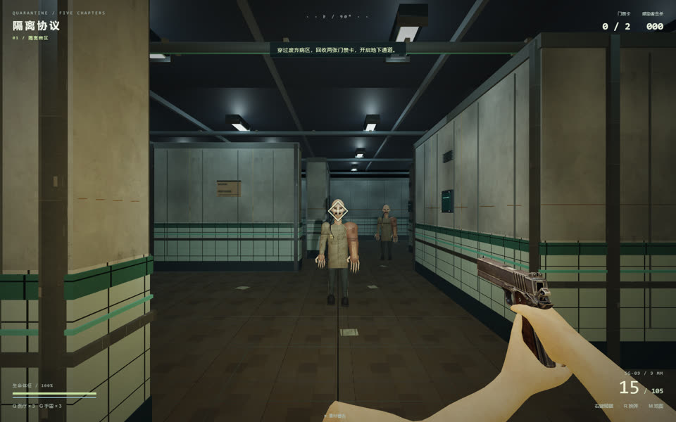
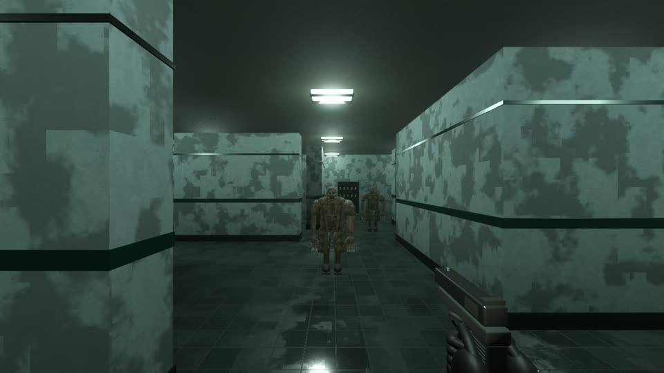

# Ward 09 — Survival Horror Demo

A bilingual, offline first-person survival shooter for Windows, developed through iterative collaboration with OpenAI Codex.

Explore an abandoned medical ward, follow radio guidance, and fight through five connected campaign zones. Switch between Chinese and English menus, objectives, subtitles, journals, and story voices in the same game.

**[Watch the development and gameplay video on YouTube](https://www.youtube.com/watch?v=wWohgJQMzwY)**

## Play

**[Download Ward 09 V1.7 for Windows — Google Drive](https://drive.google.com/drive/folders/1CIDwBjVVGEH7FWm0eBhHsJKa9j97rE3I)**

The shared folder contains both Windows 64-bit editions and the English installation guide. Choose one game package:

- `Ward09_V1.7_Windows_Setup.exe`: installer with shortcuts and an uninstaller.
- `Ward09_V1.7_Bilingual_Windows.zip`: portable edition; extract the entire archive and run `StartGame.cmd` or `Ward09.exe`.

Both packages contain the same game. No Unreal Engine, Epic Launcher, Blender, Godot, Codex, or internet connection is needed to play. A Visual C++ runtime installer is included.

The first game launch defaults to Chinese. Use the language button at the top right of the start screen or Esc menu to select English. The installer language does not select the game language.

Read [Installation and controls](INSTALL_AND_PLAY_EN.txt) before playing. Settings are saved; **campaign progress is not saved**. macOS is not currently supported. This demo is unsigned and has not been validated across a broad range of hardware.

## Features

- A medical-ward prologue followed by five connected campaign zones.
- Six enemy types, four firearms, a melee knife, and grenades.
- Objectives, pickups, enemy health bars, and a toggleable minimap.
- Short protagonist-and-radio-support exchanges, with a separate story-voice switch.
- Gameplay-driven music states, environmental audio, and combat sound effects.
- Mouse sensitivity, display modes, resolution settings, and an in-game help menu.

## How it was built

The project evolved from a browser prototype through a Godot version into an Unreal Engine demo. The creator set the direction, selected references and assets, played builds, and supplied concrete feedback. Codex helped implement systems, write Blender production scripts, integrate assets, diagnose bugs, adapt bilingual interfaces, and prepare and validate distributable builds.

Development included revising the knife swing, correcting firearm aiming alignment, repairing grenade behavior, adding loot and a campaign prologue, shortening dialogue, and implementing adaptive music. These revisions came from repeated playtesting rather than a single prompt.

OpenAI models were used during development. The shipped game runs offline; it does not claim to use live OpenAI inference during gameplay. Visual production combines generated concepts and selected textures, scripted modeling, and third-party assets. Not all models, voices, or music were generated by OpenAI.

| Browser prototype | Godot iteration |
|---|---|
|  |  |

The screenshots document different stages and viewpoints; they are not a controlled rendering benchmark. The main screenshot shows the English V1.7 game.

## Credits and scope

See [CREDITS.md](CREDITS.md). This repository presents the project and its releases; it is not a publication of the complete Unreal project or its third-party source assets. No blanket open-source license is granted for the game or its bundled assets.

This is an independent project. It is not affiliated with or endorsed by OpenAI, Epic Games, or Capcom. References to Codex describe the development tools used.

## Feedback

Please report the game version, mission, steps to reproduce, Windows version, GPU, RAM, and display resolution, ideally with a screenshot or short clip. Avoid including private information in public reports.

## Development and code

Read [the development notes](DEVELOPMENT.md) and [selected implementation files](code/README.md). These excerpts document dynamic music and bilingual display; they are not a standalone source distribution.

Created by [flyfox666](https://github.com/flyfox666).
